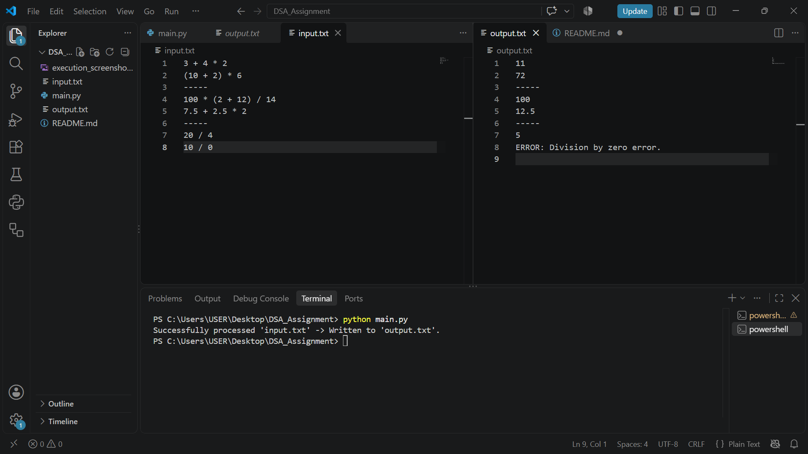

# Stack-Based Arithmetic Expression Evaluator

**Student Name:** Daniel Michael Fofanah  
**Student ID:** 905006072  
**Course:** Data Structures and Algorithms  
**Faculty:** Faculty of Information & Communication Technology  
**Institution:** Limkokwing University of Creative Technology  
**Date:** October 5 2026  

---

## Overview
This program evaluates multi-line mathematical infix expressions from `input.txt` and writes the calculated results to `output.txt`. It utilizes a custom LIFO `Stack` data structure, Dijkstra's Shunting-Yard Algorithm for infix-to-postfix conversion, and a stack-based postfix evaluator. Non-mathematical line separators (e.g., `-----`) are preserved in the output file.

## Repository Structure
- `main.py`: Source code implementing the custom Stack, tokenization, expression evaluator, and file parser.
- `input.txt`: Sample mathematical expressions and separators.
- `output.txt`: Output file generated by `main.py`.
- `README.md`: System documentation and execution guide.

## Execution Screenshot


## How to Run
1. Ensure Python 3.x is installed on your system.
2. Place `main.py` and `input.txt` in the same directory.
3. Open a terminal in the directory and run:
   ```bash
   python main.py
   ```

## Car Parking Multiplayer Car Sales Website

This repository also includes a self-hosted car listing website. Visitors can browse available and sold cars; the owner can sign in to add, edit, mark as sold, or delete listings. Listings are stored in a local SQLite database (`cars.sqlite3`), so they remain after restarting the server.

### Start the website

1. Install Python 3.8 or newer; the website uses only Python's standard library.
2. Set a private admin password in your terminal, then start the server:

   **Windows PowerShell**
   ```powershell
   $env:ADMIN_PASSWORD = "choose-a-strong-private-password"
   python web_server.py
   ```

   **macOS / Linux**
   ```bash
   ADMIN_PASSWORD="choose-a-strong-private-password" python3 web_server.py
   ```

3. Open [http://127.0.0.1:8000](http://127.0.0.1:8000). Select **Admin login** to manage the listings.

The admin password must be set every time the server starts. Keep it private. The default server listens only on your own computer; to share the site publicly, deploy it to a Python-capable host, configure a strong password, set `HOST` and `PORT` as required by the host, enable HTTPS, set `COOKIE_SECURE=1`, and follow the host's guidance for persistent disk storage. Admin sessions are cleared when the server restarts.

For car photos, use a direct image URL in the listing form. Add the player name, ID, or Discord contact details that you want buyers to use.

### Deploy to Render

The repository includes a Render Blueprint (`render.yaml`) configured for a Python web service, HTTPS-only admin cookies, a private password prompt, and a 1 GB persistent disk for SQLite. Render requires a paid web-service plan to attach persistent storage; free instances lose their local database on restarts and deploys. Review Render's current [compute pricing](https://render.com/pricing) and [disk pricing](https://render.com/pricing#disks) before creating the service.

1. Push this project, including `render.yaml`, to a GitHub repository your Render account can access.
2. In the [Render Dashboard](https://dashboard.render.com/), choose **New → Blueprint**, connect that repository, and select the branch containing these changes.
3. When prompted, enter a strong, unique `ADMIN_PASSWORD`. Do not put the password in the repository.
4. Review the paid `starter` web service and persistent disk in Render's confirmation screen before approving creation. Render will build and deploy the app and provide its public `onrender.com` URL.
5. Open that URL, choose **Admin login**, and add your listings.

The SQLite database lives on the attached disk, and this single-instance service is deliberately not configured for horizontal scaling. Back up important listing data; the Render disk is not a substitute for an independent backup. Render deploys from the linked Git branch, so push subsequent website changes to that branch to deploy them.
